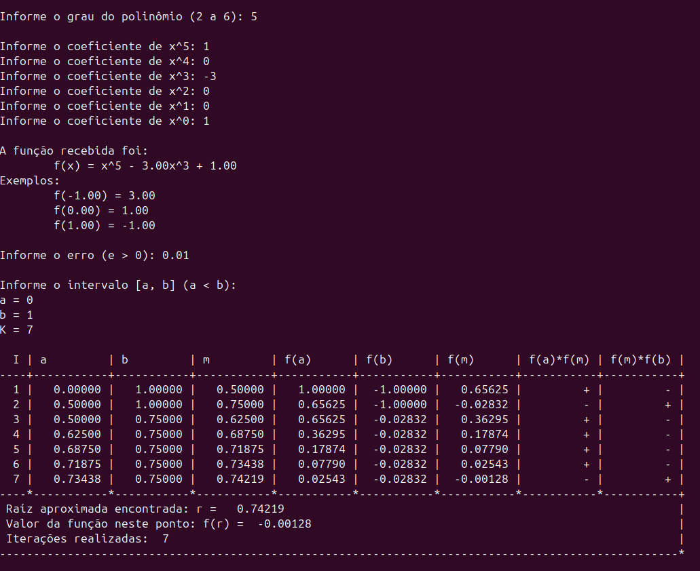

# simdic
A 'SIM'ple C script that uses the method of 'DIC'othomy to find a root of a real polynomial

This repo already comes with a binary built for Linux, running on Windows would require it to be recompiled.

### Example

